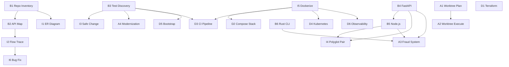

# Dependency Graph

> PML/OCL eval — 24 tasks, acyclic.



## Topological Waves

| Wave | Tasks | Parallel? |
|------|-------|-----------|
| 0 | B1, B3, B4, B6, A1, A5, A6, D1, I5 | ✓ (independent) |
| 1 | B2, B5, A2, I1, D5 | partial |
| 2 | I2, I3, I4, A4, D2, D3, D4, D6 | partial |
| 3 | I6, A3 | — |

## Full Sequential Order (tie-break by task ID)

```
B1 → B2 → B3 → B4 → B5 → B6 → I1 → I2 → I3 → I4 → I5 → I6 → A1 → A2 → A3 → A4 → A5 → A6 → D1 → D2 → D3 → D4 → D5 → D6
```

(Dependencies still enforced — this is max ordering under constraints.)

## Parallel-Safe Groups

| Group | Tasks | Condition |
|-------|-------|-----------|
| Greenfield | B4, B6 | No shared output dir |
| Post-B1 | B2, I1 | Both read B1 only |
| Infra (post-I5) | D2, D4, D6 | Disjoint manifests |

See `execution_models/parallel_execution_model.md`
